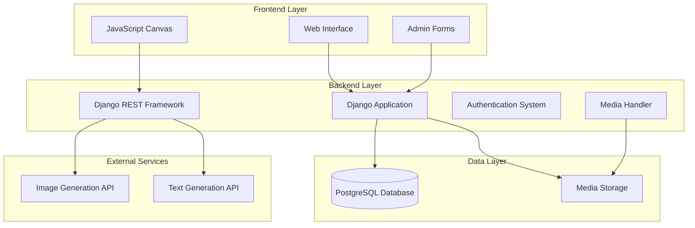

# Design Document

## Overview

The Teacher Assistant (TA) platform is a Django-based educational system that combines traditional web development with AI integration to create an interactive learning environment. The system uses a three-tier architecture with Django REST Framework for API services, JavaScript for frontend interactivity, and PostgreSQL for data persistence. Two AI services (image generation and text generation) are integrated to provide dynamic content creation and intelligent feedback.

## Architecture

### System Architecture



### Technology Stack

- **Backend**: Django 4.2+ with Python 3.10
- **API Layer**: Django REST Framework
- **Database**: PostgreSQL (production) / SQLite (development)
- **Frontend**: HTML5, CSS3, JavaScript (Canvas API)
- **Media Storage**: Django's file storage system
- **AI Integration**: HTTP clients for external AI APIs
- **Authentication**: Django's built-in authentication system

## Components and Interfaces

### Core Django Models

#### User Management
```python
# Custom User model extending AbstractUser
class CustomUser(AbstractUser):
    - email (unique)
    - first_name, last_name
    - is_admin (boolean)
    - created_at, updated_at

class Group(Model):
    - name (unique)
    - description
    - members (ManyToMany to CustomUser)
    - created_by (ForeignKey to CustomUser)
    - created_at, updated_at
```

#### Content Management
```python
class Topic(Model):
    - title
    - description
    - prompt (for AI generation)
    - background_image (ImageField)
    - instructional_text (TextField)
    - group (ForeignKey to Group)
    - created_by (ForeignKey to CustomUser)
    - created_at, updated_at

class UserTopicProgress(Model):
    - user (ForeignKey to CustomUser)
    - topic (ForeignKey to Topic)
    - is_completed (boolean)
    - final_score (0-20)
    - completed_at
```

#### Attempt Tracking
```python
class Attempt(Model):
    - user (ForeignKey to CustomUser)
    - topic (ForeignKey to Topic)
    - attempt_number (auto-increment per user/topic)
    - canvas_image (ImageField)
    - score (0-20)
    - time_spent_seconds
    - is_successful (boolean)
    - ai_feedback (TextField)
    - created_at
```

### API Endpoints Structure

#### Authentication Endpoints
- `POST /api/auth/login/` - User login
- `POST /api/auth/logout/` - User logout
- `GET /api/auth/user/` - Current user info

#### Admin Endpoints
- `POST /api/admin/users/` - Create user
- `GET /api/admin/users/` - List users
- `POST /api/admin/groups/` - Create group
- `GET /api/admin/groups/` - List groups
- `POST /api/admin/topics/` - Create topic (triggers AI generation)
- `GET /api/admin/dashboard/` - Dashboard data

#### Student Endpoints
- `GET /api/student/home/` - Home page data (groups, topics)
- `GET /api/student/topics/{id}/` - Topic details
- `POST /api/student/topics/{id}/submit/` - Submit canvas drawing
- `GET /api/student/progress/` - User progress data

### AI Integration Services

#### Image Generation Service
```python
class ImageGenerationService:
    - generate_topic_background(prompt: str) -> str (image_url)
    - generate_corrected_background(original_prompt: str, corrections: str) -> str
    - handle_api_errors() -> fallback behavior
```

#### Text Generation Service
```python
class TextGenerationService:
    - generate_instructional_text(prompt: str) -> str
    - evaluate_canvas_submission(image_data: bytes, context: dict) -> dict
    - generate_feedback_text(evaluation_result: dict) -> str
```

### Canvas Integration System

#### Frontend Canvas Manager
```javascript
class CanvasManager {
    - initializeCanvas(backgroundImage)
    - setupDrawingTools(colors, eraser, text)
    - captureCanvasData() -> base64 image
    - submitDrawing() -> API call
    - updateBackground(newImageUrl)
    - displayFeedback(feedbackText)
}
```

## Data Models

### Database Schema Design

#### Core Relationships
- Users belong to multiple Groups (ManyToMany)
- Groups contain multiple Topics (OneToMany)
- Users have multiple Attempts per Topic (OneToMany)
- UserTopicProgress tracks completion status (OneToOne per user/topic)

#### Key Indexes
- User email (unique index)
- Group name (unique index)
- Attempt user+topic+attempt_number (composite index)
- Topic group_id (foreign key index)

#### Data Validation Rules
- Email format validation
- Score range validation (0-20)
- Time spent must be positive
- Attempt numbers auto-increment per user/topic pair
- Image file type validation (PNG, JPG)

### AI Integration Data Flow

#### Topic Creation Flow
1. Admin submits topic with prompt
2. System calls Image Generation API
3. System calls Text Generation API
4. Generated content stored in database/media
5. Topic marked as ready for students

#### Submission Evaluation Flow
1. Canvas data captured as PNG
2. Image sent to Text Generation API with context
3. AI returns evaluation (score, feedback, corrections)
4. If incorrect: new background image generated
5. Updated instructional text generated
6. Attempt record created with all data

## Error Handling

### AI Service Error Handling
- **API Timeout**: Retry with exponential backoff (3 attempts)
- **Rate Limiting**: Queue requests and implement delays
- **Invalid Response**: Log error, use fallback content
- **Network Errors**: Graceful degradation with cached content

### Canvas Error Handling
- **Canvas Not Supported**: Display compatibility message
- **Drawing Errors**: Auto-save functionality with recovery
- **Submission Failures**: Retry mechanism with user feedback
- **Large File Sizes**: Client-side compression before upload

### Database Error Handling
- **Connection Failures**: Connection pooling with retry logic
- **Constraint Violations**: User-friendly error messages
- **Migration Errors**: Rollback procedures and data integrity checks
- **Concurrent Access**: Optimistic locking for attempt submissions

## Testing Strategy

### Unit Testing
- **Model Tests**: Validation, relationships, custom methods
- **Service Tests**: AI integration services with mocked APIs
- **API Tests**: All endpoints with various input scenarios
- **Utility Tests**: Canvas data processing, file handling

### Integration Testing
- **AI Workflow Tests**: End-to-end topic creation and evaluation
- **Canvas Submission Tests**: Complete submission pipeline
- **Authentication Tests**: Login/logout flows and permissions
- **Admin Dashboard Tests**: Data aggregation and display

### Frontend Testing
- **Canvas Functionality**: Drawing tools, background updates
- **Form Validation**: Client-side validation rules
- **API Integration**: AJAX calls and error handling
- **Responsive Design**: Cross-browser and device testing

### Performance Testing
- **Database Queries**: N+1 query prevention, indexing optimization
- **File Upload**: Large canvas image handling
- **AI API Calls**: Concurrent request handling
- **Dashboard Loading**: Large dataset pagination and caching

### Security Testing
- **Authentication**: Session management and CSRF protection
- **File Upload**: Image validation and sanitization
- **API Endpoints**: Permission checks and input validation
- **AI Integration**: API key security and request validation

## Deployment Considerations

### Environment Configuration
- **Development**: SQLite, debug mode, local file storage
- **Production**: PostgreSQL, secure settings, cloud storage
- **API Keys**: Environment variables with validation
- **Media Files**: CDN integration for generated images

### Scalability Design
- **Database**: Connection pooling and query optimization
- **AI Services**: Request queuing and caching strategies
- **Media Storage**: Separate storage service for large files
- **Session Management**: Redis for session storage in production

### Monitoring and Logging
- **AI API Usage**: Request tracking and cost monitoring
- **Performance Metrics**: Response times and error rates
- **User Activity**: Attempt patterns and completion rates
- **System Health**: Database performance and storage usage